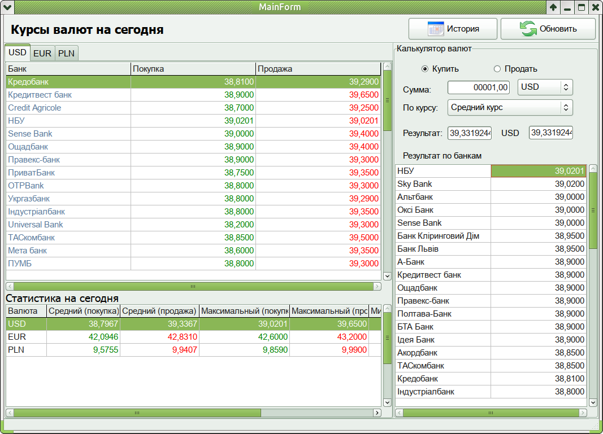
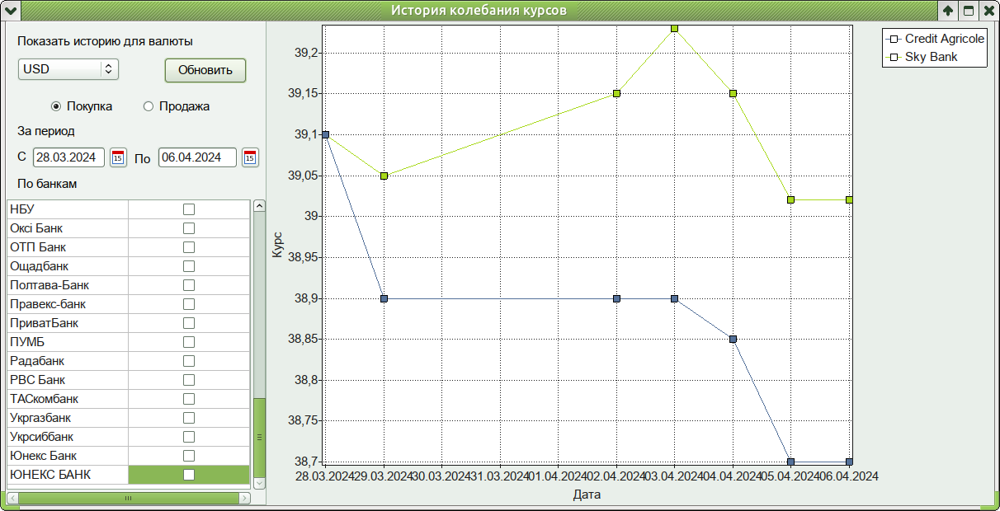

## Money v1.0

### Description
        
Application for get currencies from sites and calculation of buy and sell sum

--------------

### Dependencies

 - Gtk-2.x
 - ZeodDB
 - Postgres
 - Multilog from Lazarus repo

-------------
### Compiled in

 - Linux Mint 20.3 Una, base: Ubuntu 20.04 focal
 - Lazarus v3.2

------------ 
         (c) Copyright april 2024 by TechnoMag aka Iliya Kobzev
         
